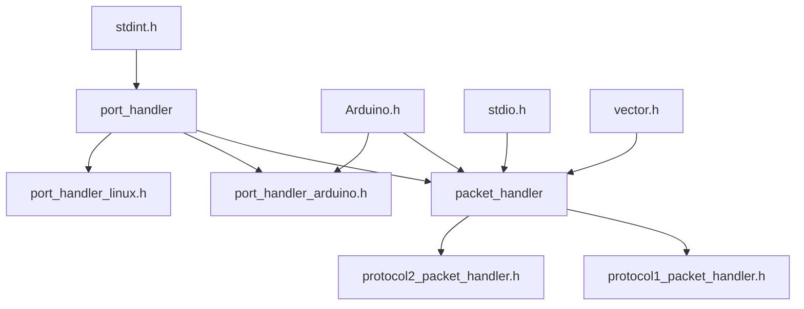

DynamixelSDK For OpenCR 代码分析

## 背景

​    该软件包是用于  [ROBOTIS Dynamixel SDK](http://wiki.ros.org/dynamixel_sdk) 舵机的库。 ROBOTIS Dynamixel SDK，简称SDK，是一个软件开发库，提供了基于数据包通信的控制舵机的函数。

​    官方使用文档https://emanual.robotis.com/docs/en/software/dynamixel/dynamixel_sdk/overview/

​    官方的代码仓库在https://github.com/ROBOTIS-GIT/DynamixelSDK

​    此仓库包含SDK在多种编程语言的实现，包括C、C++、java、matlab、python。这里只讨论C++版本，C++内部有包含兼容OpenCR/Arduino的实现。

注： OpenCR是Robotis公司的一块嵌入式STM32的板子，兼容Arduino。可以使用Arduino IDE来实现在OpenCR上对Dynamixel舵机的控制。

​    Dynamixel舵机是串行总线舵机。跟普通的PWM舵机不一样，他会有一套通信协议。根据需求封装好数据利用串口与舵机通信，从而控制舵机。

## 工程目录


  在DynamixelSDK有多种读写串口的方式：

1. 普通型——dynamixel::PacketHandler

2. 加强型——dynamixel::GroupSyncRead dynamixel::GroupSyncWrite(同步读写)

3. 至尊型——dynamixel::GroupBulkRead dynamixel::GroupBulkWrite(批量读写)

   对于同步读写，代码注释写着**The class for writing/reading multiple Dynamixel data from same address with same length at once**，表明可以一次性从多个舵机中读取相同地址（相同控制项）。

   对于批量读写，代码注释写着**The class for writing/reading multiple Dynamixel data from different addresses with different lengths at once**，表明可以一次性从多个舵机中读取不同地址的不同数据（不同控制项）

   这里只关注最基础的读写方式，不去关注同步读写以及批量读写。

## 头文件依赖



## port_handler.h

​    串口总线舵机最基础的功能就是串口通信。这里需要在不同设备上实现不同的串口通信。Windows、Mac、Linux、Arduino等。对于Linux来说可能常见的是利用USB转串口模块，对于Arduino来说则是UART模块。连接方式上可以是RS485、TTL。

​    一个串口通信的实现需要什么内容。第一个就是设备名称或模块名称。例如在Linux中可能就是类似port_name = “/dev/ttyUSB0”，而在Arduino中则相对简单，使用一个串口设备“Serial3”。第二个内容是波特率，需要指明数据传输的速率。第三个内容就是串口设备的打开与关闭。第四个内容是串口设备的读写。

​    port_handler.h中的代码注释已经足够丰富，这里就稍微解释一些，同时做一些删减方便理解。特别是Windows与Mac相关代码。

```c++
/// @author Zerom, Leon (RyuWoon Jung)
#ifdef __GNUC__
#define DEPRECATED __attribute__((deprecated))
#else
#pragma message("WARNING: You need to implement DEPRECATED for this compiler")
#define DEPRECATED
#endif
//// 宏	DEPRECATED表示已弃用，用来管理过时的代码。可参考https://blog.csdn.net/martinue/article/details/84584261
#include <stdint.h>
namespace dynamixel
{
/// @brief 这个类用于串口控制，有以下子类PortHandlerLinux PortHandlerArduino
class PortHandler
{
 public:
  static const int DEFAULT_BAUDRATE_ = 57600; ///< 默认波特率    
  /// @brief 返回子类对象
  /// @description 返回子类对象 PortHandlerLinux / PortHandlerArduino.
  static PortHandler *getPortHandler(const char *port_name);
  bool   is_using_; ///< 布尔值，说明串口是否使用
  virtual ~PortHandler() { }
  virtual bool    openPort() = 0;    /// @brief 打开串口
  virtual void    closePort() = 0;   /// @brief 关闭串口 
  virtual void    clearPort() = 0;  /// @brief 清空串口数据
  /// @brief 设置PortHandler串口控制器的串口名臣
  virtual void    setPortName(const char* port_name) = 0;
  virtual char   *getPortName() = 0;
  ///  设置波特率、获取波特率
  virtual bool    setBaudRate(const int baudrate) = 0;
  virtual int     getBaudRate() = 0;
  /// @brief 检查在串口buffer中有多少字节可以读取
  virtual int     getBytesAvailable() = 0;
  /// @brief 从串口缓存中读取字节
  virtual int     readPort(uint8_t *packet, int length) = 0;
  /// @brief 向串口缓存写入字节数据
  virtual int     writePort(uint8_t *packet, int length) = 0;

  /// 该函数通过获取当前时间和数据包超时时间以及数据包长度来设置秒表
  virtual void    setPacketTimeout(uint16_t packet_length) = 0;
  
  /// 该函数通过使用获取当前时间和分组超时时间来设置秒表。
  virtual void    setPacketTimeout(double msec) = 0;
  
  /// @brief 检查是否超时
  /// @description The function checks whether current time is passed by the time of packet timeout from the time set by PortHandlerLinux::setPacketTimeout().
  virtual bool    isPacketTimeout() = 0;
};
}
```

## port_handler.cpp

```c++
#if defined(__linux__)
#include "port_handler.h"
#include "port_handler_linux.h"
#elif defined(ARDUINO) || defined(__OPENCR__) || defined(__OPENCM904__)
#include "../../include/dynamixel_sdk/port_handler.h"
#include "../../include/dynamixel_sdk/port_handler_arduino.h"
#endif
using namespace dynamixel;
/// 逻辑是根据不同的平台，在堆区创建不同的串口控制器子类，并返回地址给调用方。
PortHandler *PortHandler::getPortHandler(const char *port_name)
{
#if defined(__linux__)
  return (PortHandler *)(new PortHandlerLinux(port_name));
#elif defined(ARDUINO) || defined(__OPENCR__) || defined(__OPENCM904__)
  return (PortHandler *)(new PortHandlerArduino(port_name));
#endif
}

```

## port_handler_arduino.h

​    重点来关注Arduino平台上的实现。还是一样Arduino平台具体的板子是OpenCR。

​    首先还是来了解一下Arduino对串口通信的支持。详情请看

​    https://www.arduino.cc/reference/en/language/functions/communication/serial/

​    Arduino对于通信有USBSerial UARTClass Serial类，用于 Arduino 板和计算机或其他设备之间的通信。所有 Arduino 板都有至少一个串行端口（也称为 UART 或 USART），有些有几个。而在OpenCR中一共有四个提供给Arduino。 

```c++
extern USBSerial Serial;    // USB  利用此串口来更新程序以及与电脑通信
extern UARTClass Serial1;   // Arduino Serial
extern UARTClass Serial2;   // Ext Serial for Bluetooth 
extern UARTClass Serial3;   // Ext Serial for Dynamixel  用于Dynamixel舵机
extern UARTClass Serial4;   // Ext Serial for Bluetooth
```

​    Serial常用的方法如下：

```C++
    // https://www.cnblogs.com/gaosheng-221/p/6641060.html
    Serial.begin(); //开启串行通信接口并设置通信波特率
    Serial.end();    //关闭通信串口
    Serial.available();//判断串口缓冲器是否有数据装入
    Serial.read();    //读取串口数据
    Serial.peek();    //返回下一字节(字符)输入数据，但不删除它
    Serial.flush();    //清空串口缓存
    Serial.print();    //写入字符串数据到串口
    Serial.println();   //写入字符串数据+换行到串口
    Serial.write();     //写入二进制数据到串口
    Serial.SerialEvent();//read时触发的事件函数
    Serial.readBytes(buffer,length);//读取固定长度的二进制流
    Serial.println(incomingByte, DEC);//打印接到数据十进制表示的ascii码。  HEX 十六进制表示 
```

​    对于舵机串口通信功能的实现就将基于Serial来进行。同时还有一个问题，就是这个串行总线舵机的供电问题。这种舵机的推荐工作电压是12V，需要特殊的驱动电路。我对硬件电路不了解，就不乱说了。在OpenCR中驱动舵机就需要插入12V直流供电，然后Arduino上有一个引脚来使能对舵机的供电。具体名称：

```c++
#define BDPIN_DXL_PWR_EN        32    // 使能舵机供电
```

​    代码实现上就继承PortHandler，对外提供统一的接口。

```c++
#include <Arduino.h>
#include "port_handler.h"
namespace dynamixel
{

////////////////////////////////////////////////////////////////////////////////
/// @brief The class for control port in Arduino
////////////////////////////////////////////////////////////////////////////////
class PortHandlerArduino : public PortHandler
{
 private:
  int     socket_fd_;               // Arduino 上没有使用
  int     baudrate_;                // 波特率
  char    port_name_[100];          // 串口名称，Arduino："" Linux: "/dev/ttyUSB0" Win: "com3"
  double  packet_start_time_;       // 通信开始的时间
  double  packet_timeout_;          // 超时？？？
  double  tx_time_per_byte;        // 平均每个字节发送所需时间
    
  bool    setupPort(const int cflag_baud);   // 设置串口 开启串行通信接口并设置通信波特率
  double  getCurrentTime();                  // 获得当前时间
  double  getTimeSinceStart();               // 
  int     checkBaudrateAvailable(int baudrate);  // 检查波特率是否可用
  void    setPowerOn();                     // 使能舵机供电 digitalWrite(BDPIN_DXL_PWR_EN, HIGH)
  void    setPowerOff();                    // 禁用舵机供电 digitalWrite(BDPIN_DXL_PWR_EN, HIGH)
  void    setTxEnable();                   // 使能传输，OpenCR板子专用函数drv_dxl_tx_enable   
  void    setTxDisable();                  // 禁用传输，drv_dxl_tx_enable

 public:
  /// @brief 实例化PortHandler
  /// @description The function initializes instance of PortHandler and gets port_name.
  PortHandlerArduino(const char *port_name);             // 构造函数
  virtual ~PortHandlerArduino() { closePort(); }         // 结束时关闭串口

  bool    openPort();
  void    closePort();
  void    clearPort();
  void    setPortName(const char *port_name);
  char   *getPortName();
  bool    setBaudRate(const int baudrate);
  int     getBaudRate();
  int     getBytesAvailable();

  int     readPort(uint8_t *packet, int length);
  int     writePort(uint8_t *packet, int length);

  void    setPacketTimeout(uint16_t packet_length);
  void    setPacketTimeout(double msec);
  bool    isPacketTimeout();
};
}
```

## port_handler_arduino.cpp

实现具体的串口控制器，在Arduino平台上使用UARTClass类来实现。

```c++
#if defined (__OPENCR__)
#define DYNAMIXEL_SERIAL  Serial3
#endif
#define LATENCY_TIMER     4  // msec (USB latency timer)
using namespace dynamixel;
// 构造函数，初始化私有变量
PortHandlerArduino::PortHandlerArduino(const char *port_name)
  : baudrate_(DEFAULT_BAUDRATE_),
    packet_start_time_(0.0),
    packet_timeout_(0.0),
    tx_time_per_byte(0.0)
{
  is_using_ = false;
  setPortName(port_name);
  pinMode(BDPIN_DXL_PWR_EN, OUTPUT); // 设置舵机供电端口为输出模式
  setPowerOff();                     // 设置舵机供电端口为低电平
  setTxDisable();                    // 禁止传输 ？？
}
// 打开串口
bool PortHandlerArduino::openPort()
{
  pinMode(BDPIN_DXL_PWR_EN, OUTPUT); // 设置舵机供电端口为输出模式
  setPowerOn();                      // 设置舵机供电端口为高电平
  delay(1000);     
  return setBaudRate(baudrate_);     // 设置波特率
}

void PortHandlerArduino::closePort()
{
  setPowerOff();                     // 设置舵机供电端口为低电平
}

void PortHandlerArduino::clearPort()
{
  DYNAMIXEL_SERIAL.flush();         // 清空串口缓存
  // Clear out all data from the input queue. 
  while (DYNAMIXEL_SERIAL.available())
  {
    DYNAMIXEL_SERIAL.read();       // 当有数据时，读取不做保存，不做处理
  }
}
void PortHandlerArduino::setPortName(const char *port_name){strcpy(port_name_, port_name);}
char *PortHandlerArduino::getPortName(){return port_name_;}
bool PortHandlerArduino::setBaudRate(const int baudrate)
{
  baudrate_ = checkBaudrateAvailable(baudrate);
  if (baudrate_ == -1)
    return false;        // 检查波特率是否可用，9600，,12500
  setupPort(baudrate_);  // 实际设置波特率方法
  return true;
}
int PortHandlerArduino::getBaudRate(){return baudrate_;}
int PortHandlerArduino::getBytesAvailable(){
  int bytes_available;
  bytes_available = DYNAMIXEL_SERIAL.available();// 判断串口缓冲器是否有数据装入
  return bytes_available;
}
// 读取最多length个数据，将数据保存到packet中
int PortHandlerArduino::readPort(uint8_t *packet, int length)
{
  int rx_length;
  rx_length = DYNAMIXEL_SERIAL.available();// 判断串口缓冲器是否有数据装入，有多少
  if (rx_length > length)
    rx_length = length;
  for (int i = 0; i < rx_length; i++)
  {
    packet[i] = DYNAMIXEL_SERIAL.read();
  }
  return rx_length;
}
// 向串口写入数据
int PortHandlerArduino::writePort(uint8_t *packet, int length){
  int length_written;
  setTxEnable();  // 使能串口传输
  length_written = DYNAMIXEL_SERIAL.write(packet, length); // 写入数据
  setTxDisable(); // 禁用串口传输
  return length_written;
}

void PortHandlerArduino::setPacketTimeout(uint16_t packet_length)
{
  packet_start_time_  = getCurrentTime();
  packet_timeout_     = (tx_time_per_byte * (double)packet_length) + (LATENCY_TIMER * 2.0) + 2.0;
}

void PortHandlerArduino::setPacketTimeout(double msec)
{
  packet_start_time_  = getCurrentTime();
  packet_timeout_     = msec;
}

bool PortHandlerArduino::isPacketTimeout()
{
  if (getTimeSinceStart() > packet_timeout_)
  {
    packet_timeout_ = 0;
    return true;
  }

  return false;
}

double PortHandlerArduino::getCurrentTime()
{
  return (double)millis(); // 获取当前时间
}

double PortHandlerArduino::getTimeSinceStart()
{
  double elapsed_time;
  elapsed_time = getCurrentTime() - packet_start_time_;
  if (elapsed_time < 0.0)
    packet_start_time_ = getCurrentTime();
  return elapsed_time;
}
// 设置波特率
bool PortHandlerArduino::setupPort(int baudrate)
{
  DYNAMIXEL_SERIAL.begin(baudrate); // 设置串口波特率
  delay(100);
  tx_time_per_byte = (1000.0 / (double)baudrate) * 10.0; // 设置单字节传输速率
  return true;
}

int PortHandlerArduino::checkBaudrateAvailable(int baudrate){
  switch(baudrate)
  {
    case 9600:
      return 9600;
    /*.............
          省略剩余判断
    */          
    default:
      return -1;
  }
}

void PortHandlerArduino::setPowerOn(){digitalWrite(BDPIN_DXL_PWR_EN, HIGH); // 舵机供电端口设置为高电平
}
void PortHandlerArduino::setPowerOff(){digitalWrite(BDPIN_DXL_PWR_EN, LOW);// 舵机供电端口设置为低电平
}
void PortHandlerArduino::stTxEnable(){
  drv_dxl_tx_enable(TRUE); // ??
}
void PortHandlerArduino::setTxDisable(){
#ifdef SERIAL_WRITES_NON_BLOCKING
  DYNAMIXEL_SERIAL.flush(); // make sure it completes before we disable... 
#endif
  drv_dxl_tx_enable(FALSE); // ？？
}


```

packet_handler.h

现在有了一个串口来与舵机进行通信，那么接下来就需要指明通信内容、格式。Dynamixel的通信有两套协议，Protocol1与Protocol2。这里关注[Protocol1](https://emanual.robotis.com/docs/en/dxl/protocol)的内容。协议组成可分为：

1. 协议头(header)，指明协议开始，两字节 0xFF 0xFF
2. 舵机ID号(Packet ID)，需要控制的舵机ID，一字节，254(0xFE)为广播号，会与所有舵机通信
3. 指令长度(length)，指令+ 参数 + 校验和的字节数
4. 指令(instruction)，常用：0x01 ping 、0x02 read、0x03 write
5. 指令参数(Parameters)
6. 校验和(checksum)，**Checksum = ~( ID + Length + Instruction + Parameter1 + … Parameter N )**

与舵机通信后，同样需要返回舵机的状态。返回格式如下。相比之下多了错误处理的内容。具体请参考官方手册。

| Header1 | Header2 | Packet ID | Length | Error | Param 1 |  …   | Param N | Checksum |
| :-----: | :-----: | :-------: | :----: | :---: | :-----: | :--: | :-----: | :------: |
|  0xFF   |  0xFF   |    ID     | Length | Error | Param 1 |  …   | Param N |  CHKSUM  |

​    协议的基本格式清楚了之后，就可以来实现协议控制器。同串口控制器一样的设计思路，对外用统一的PacketHandler父类，不同协议继承父类成为子类。

   父类需要向外提供

1. 获取具体协议控制器，协议类型
2. 根据反馈内容判断通信结果与错误原因
3. 封装具体的通信内容，并发送
4. 获取反馈的通信内容
5. 读取舵机控制信息，分1字节 2字节 4字节
6. 写入舵机控制信息，分1字节 2字节 4字节


```c++
#if defined(ARDUINO) || defined(__OPENCR__) || defined(__OPENCM904__)
#include <Arduino.h>
#define ERROR_PRINT  SerialBT2.print	
#else
#define ERROR_PRINT  printf
#endif

#include <stdio.h>
#include <vector>
#include "port_handler.h"

#define BROADCAST_ID        0xFE    // 254
#define MAX_ID              0xFC    // 252

/* Macro for Control Table Value */
#define DXL_MAKEWORD(a, b)  ((uint16_t)(((uint8_t)(((uint64_t)(a)) & 0xff)) | ((uint16_t)((uint8_t)(((uint64_t)(b)) & 0xff))) << 8))
#define DXL_MAKEDWORD(a, b) ((uint32_t)(((uint16_t)(((uint64_t)(a)) & 0xffff)) | ((uint32_t)((uint16_t)(((uint64_t)(b)) & 0xffff))) << 16))
#define DXL_LOWORD(l)       ((uint16_t)(((uint64_t)(l)) & 0xffff))
#define DXL_HIWORD(l)       ((uint16_t)((((uint64_t)(l)) >> 16) & 0xffff))
#define DXL_LOBYTE(w)       ((uint8_t)(((uint64_t)(w)) & 0xff))
#define DXL_HIBYTE(w)       ((uint8_t)((((uint64_t)(w)) >> 8) & 0xff))

/* Instruction for DXL Protocol 协议指令 */
#define INST_PING               1  
#define INST_READ               2
#define INST_WRITE              3

// 通信结果
#define COMM_SUCCESS        0       // 传输或接收成功
#define COMM_PORT_BUSY      -1000   // 串口忙
#define COMM_TX_FAIL        -1001   // 发送失败 Failed transmit instruction packet
#define COMM_RX_FAIL        -1002   // 接收四边 Failed get status packet
#define COMM_TX_ERROR       -2000   // 错误发送包
#define COMM_RX_WAITING     -3000   // 正在接收
#define COMM_RX_TIMEOUT     -3001   // 没有返回包
#define COMM_RX_CORRUPT     -3002   // 返回包错误Incorrect status packet
#define COMM_NOT_AVAILABLE  -9000   //

namespace dynamixel
{
class PacketHandler
{
 protected:
  PacketHandler() { }
 public:
  // 返回协议控制实例
  static PacketHandler *getPacketHandler(float protocol_version = 1.0);
  virtual ~PacketHandler() { }
  virtual float   getProtocolVersion() = 0;  /// 返回协议版本号
  /// 解读通信结果，是否成功，失败原因
  virtual const char *getTxRxResult     (int result) = 0;
  /// 解读返回包的错误原因，输入电压、角度限制、过热、
  virtual const char *getRxPacketError  (uint8_t error) = 0;
    
  /// 利用串口控制器传输指令包，先清空串口缓存，利用writePort方法传输数据。
  virtual int txPacket        (PortHandler *port, uint8_t *txpacket) = 0;
  /// 接收返回包 @brief The function that receives packet (rxpacket) during designated time via PortHandler port
  virtual int rxPacket        (PortHandler *port, uint8_t *rxpacket) = 0;
  /// 传输包，并接收包 @brief The function that transmits packet (txpacket) and receives packet (rxpacket) during designated time via PortHandler port
  virtual int txRxPacket      (PortHandler *port, uint8_t *txpacket, uint8_t *rxpacket, uint8_t *error = 0) = 0;
    
  /// ping 舵机
  virtual int ping            (PortHandler *port, uint8_t id, uint8_t *error = 0) = 0;
  /// ping 舵机，并获取舵机模型编号
  virtual int ping            (PortHandler *port, uint8_t id, uint16_t *model_number, uint8_t *error = 0) = 0;
    
  /// 读取返回包的数据 @brief The function that receives the packet and reads the data in the packet
  virtual int readRx          (PortHandler *port, uint8_t id, uint16_t length, uint8_t *data, uint8_t *error = 0) = 0;

  ///  @brief The function that calls PacketHandler::readTx() function for reading 1 byte data
  virtual int read1ByteTx     (PortHandler *port, uint8_t id, uint16_t address) = 0;

  /// @brief The function that calls PacketHandler::readRx() function and reads 1 byte data on the packet
  virtual int read1ByteRx     (PortHandler *port, uint8_t id, uint8_t *data, uint8_t *error = 0) = 0;

  /// @brief The function that calls PacketHandler::readTxRx() function for reading 1 byte data
  virtual int read1ByteTxRx   (PortHandler *port, uint8_t id, uint16_t address, uint8_t *data, uint8_t *error = 0) = 0;

  virtual int read2ByteTx     (PortHandler *port, uint8_t id, uint16_t address) = 0;
  virtual int read2ByteRx     (PortHandler *port, uint8_t id, uint16_t *data, uint8_t *error = 0) = 0;
  virtual int read2ByteTxRx   (PortHandler *port, uint8_t id, uint16_t address, uint16_t *data, uint8_t *error = 0) = 0;
  virtual int read4ByteTx     (PortHandler *port, uint8_t id, uint16_t address) = 0;

  virtual int read4ByteRx     (PortHandler *port, uint8_t id, uint32_t *data, uint8_t *error = 0) = 0;
  virtual int read4ByteTxRx   (PortHandler *port, uint8_t id, uint16_t address, uint32_t *data, uint8_t *error = 0) = 0;

  ////////////////////////////////////////////////////////////////////////////////
  /// @brief The function that transmits INST_WRITE instruction packet with the data for write
  /// @description The function makes an instruction packet with INST_WRITE and the data for write,
  /// @description transmits the packet with PacketHandler::txPacket().
  /// @param port PortHandler instance
  /// @param id Dynamixel ID
  /// @param address Address of the data for write
  /// @param length Length of the data for write
  /// @param data Data for write
  /// @return communication results which come from PacketHandler::txPacket()
  ////////////////////////////////////////////////////////////////////////////////
  virtual int writeTxOnly     (PortHandler *port, uint8_t id, uint16_t address, uint16_t length, uint8_t *data) = 0;

  ////////////////////////////////////////////////////////////////////////////////
  /// @brief The function that transmits INST_WRITE instruction packet with the data for write, and receives the packet
  /// @description The function makes an instruction packet with INST_WRITE and the data for write,
  /// @description transmits and receives the packet with PacketHandler::txRxPacket(),
  /// @description gets the error from the packet.
  /// @param port PortHandler instance
  /// @param id Dynamixel ID
  /// @param address Address of the data for write
  /// @param length Length of the data for write
  /// @param data Data for write
  /// @param error Dynamixel hardware error
  /// @return communication results which come from PacketHandler::txRxPacket()
  ////////////////////////////////////////////////////////////////////////////////
  virtual int writeTxRx       (PortHandler *port, uint8_t id, uint16_t address, uint16_t length, uint8_t *data, uint8_t *error = 0) = 0;

  /// @brief The function that calls PacketHandler::writeTxOnly() for writing 1 byte data
  virtual int write1ByteTxOnly(PortHandler *port, uint8_t id, uint16_t address, uint8_t data) = 0;

  /// @brief The function that calls PacketHandler::writeTxRx() for writing 1 byte data and receives the packet
  virtual int write1ByteTxRx  (PortHandler *port, uint8_t id, uint16_t address, uint8_t data, uint8_t *error = 0) = 0;
  virtual int write2ByteTxOnly(PortHandler *port, uint8_t id, uint16_t address, uint16_t data) = 0;
  virtual int write2ByteTxRx  (PortHandler *port, uint8_t id, uint16_t address, uint16_t data, uint8_t *error = 0) = 0;
  virtual int write4ByteTxOnly(PortHandler *port, uint8_t id, uint16_t address, uint32_t data) = 0;
  virtual int write4ByteTxRx  (PortHandler *port, uint8_t id, uint16_t address, uint32_t data, uint8_t *error = 0) = 0;
};
}

```

## packet_handler.cpp

根据协议版本获取实例。

```c++
PacketHandler *PacketHandler::getPacketHandler(float protocol_version)
{
  if (protocol_version == 1.0)
  {
    return (PacketHandler *)(Protocol1PacketHandler::getInstance());
  }
  else if (protocol_version == 2.0)
  {
    return (PacketHandler *)(Protocol2PacketHandler::getInstance());
  }
  return (PacketHandler *)(Protocol2PacketHandler::getInstance());
}
```

## protocol1_packet_handler.h

```c++
#include "packet_handler.h"

namespace dynamixel
{
class Protocol1PacketHandler : public PacketHandler
{
 private:
  static Protocol1PacketHandler *unique_instance_;

  Protocol1PacketHandler();

 public:
   static Protocol1PacketHandler *getInstance() { return unique_instance_; }
  // 省略析构函数、父类虚函数
};
}
```


## protocol1_packet_handler.cpp

具体实现

```c++
/* Author: zerom, Ryu Woon Jung (Leon) */
#if defined(ARDUINO) || defined(__OPENCR__) || defined(__OPENCM904__)
#include "../../include/dynamixel_sdk/protocol1_packet_handler.h"
#endif

#include <string.h>
#include <stdlib.h>

#define TXPACKET_MAX_LEN    (250)
#define RXPACKET_MAX_LEN    (250)

///////////////// for Protocol 1.0 Packet /////////////////
#define PKT_HEADER0             0
#define PKT_HEADER1             1
#define PKT_ID                  2
#define PKT_LENGTH              3
#define PKT_INSTRUCTION         4
#define PKT_ERROR               4
#define PKT_PARAMETER0          5

///////////////// Protocol 1.0 Error bit /////////////////
#define ERRBIT_VOLTAGE          1       // Supplied voltage is out of the range (operating volatage set in the control table)
#define ERRBIT_ANGLE            2       // Goal position is written out of the range (from CW angle limit to CCW angle limit)
#define ERRBIT_OVERHEAT         4       // Temperature is out of the range (operating temperature set in the control table)
#define ERRBIT_RANGE            8       // Command(setting value) is out of the range for use.
#define ERRBIT_CHECKSUM         16      // Instruction packet checksum is incorrect.
#define ERRBIT_OVERLOAD         32      // The current load cannot be controlled by the set torque.
#define ERRBIT_INSTRUCTION      64      // Undefined instruction or delivering the action command without the reg_write command.

using namespace dynamixel;

Protocol1PacketHandler *Protocol1PacketHandler::unique_instance_ = new Protocol1PacketHandler();

Protocol1PacketHandler::Protocol1PacketHandler() { }

const char *Protocol1PacketHandler::getTxRxResult(int result)
{
  switch(result)
  {
    case COMM_SUCCESS:
      return "[TxRxResult] Communication success.";

    case COMM_PORT_BUSY:
      return "[TxRxResult] Port is in use!";

    case COMM_TX_FAIL:
      return "[TxRxResult] Failed transmit instruction packet!";
   // 省略部分错误处理
    default:
      return "";
  }
}

const char *Protocol1PacketHandler::getRxPacketError(uint8_t error)
{
  if (error & ERRBIT_VOLTAGE)
    return "[RxPacketError] Input voltage error!";

  if (error & ERRBIT_ANGLE)
    return "[RxPacketError] Angle limit error!";

  if (error & ERRBIT_OVERHEAT)
    return "[RxPacketError] Overheat error!";

  if (error & ERRBIT_RANGE)
    return "[RxPacketError] Out of range error!";

  if (error & ERRBIT_CHECKSUM)
    return "[RxPacketError] Checksum error!";

  if (error & ERRBIT_OVERLOAD)
    return "[RxPacketError] Overload error!";

  if (error & ERRBIT_INSTRUCTION)
    return "[RxPacketError] Instruction code error!";

  return "";
}

int Protocol1PacketHandler::txPacket(PortHandler *port, uint8_t *txpacket)
{
  uint8_t checksum               = 0;
  uint8_t total_packet_length    = txpacket[PKT_LENGTH] + 4; // 4: HEADER0 HEADER1 ID LENGTH
  uint8_t written_packet_length  = 0;

  if (port->is_using_)
    return COMM_PORT_BUSY;
  port->is_using_ = true;

  // check max packet length
  if (total_packet_length > TXPACKET_MAX_LEN)
  {
    port->is_using_ = false;
    return COMM_TX_ERROR;
  }

  // make packet header
  txpacket[PKT_HEADER0]   = 0xFF;
  txpacket[PKT_HEADER1]   = 0xFF;

  // add a checksum to the packet
  for (uint16_t idx = 2; idx < total_packet_length - 1; idx++)   // except header, checksum
    checksum += txpacket[idx];
  txpacket[total_packet_length - 1] = ~checksum;

  // tx packet
  port->clearPort();
  written_packet_length = port->writePort(txpacket, total_packet_length);
  if (total_packet_length != written_packet_length)
  {
    port->is_using_ = false;
    return COMM_TX_FAIL;
  }

  return COMM_SUCCESS;
}

int Protocol1PacketHandler::rxPacket(PortHandler *port, uint8_t *rxpacket)
{
  int     result         = COMM_TX_FAIL;

  uint8_t checksum       = 0;
  uint8_t rx_length      = 0;
  uint8_t wait_length    = 6;    // minimum length (HEADER0 HEADER1 ID LENGTH ERROR CHKSUM)

  while(true)
  {
    rx_length += port->readPort(&rxpacket[rx_length], wait_length - rx_length);
    if (rx_length >= wait_length)
    {
      uint8_t idx = 0;

      // find packet header
      for (idx = 0; idx < (rx_length - 1); idx++)
      {
        if (rxpacket[idx] == 0xFF && rxpacket[idx+1] == 0xFF)
          break;
      }

      if (idx == 0)   // found at the beginning of the packet
      {
        if (rxpacket[PKT_ID] > 0xFD ||                  // unavailable ID
            rxpacket[PKT_LENGTH] > RXPACKET_MAX_LEN ||  // unavailable Length
            rxpacket[PKT_ERROR] > 0x7F)                 // unavailable Error
        {
            // remove the first byte in the packet
            for (uint16_t s = 0; s < rx_length - 1; s++)
              rxpacket[s] = rxpacket[1 + s];
            //memcpy(&rxpacket[0], &rxpacket[idx], rx_length - idx);
            rx_length -= 1;
            continue;
        }

        // re-calculate the exact length of the rx packet
        if (wait_length != rxpacket[PKT_LENGTH] + PKT_LENGTH + 1)
        {
          wait_length = rxpacket[PKT_LENGTH] + PKT_LENGTH + 1;
          continue;
        }

        if (rx_length < wait_length)
        {
          // check timeout
          if (port->isPacketTimeout() == true)
          {
            if (rx_length == 0)
            {
              result = COMM_RX_TIMEOUT;
            }
            else
            {
              result = COMM_RX_CORRUPT;
            }
            break;
          }
          else
          {
            continue;
          }
        }

        // calculate checksum
        for (uint16_t i = 2; i < wait_length - 1; i++)   // except header, checksum
          checksum += rxpacket[i];
        checksum = ~checksum;

        // verify checksum
        if (rxpacket[wait_length - 1] == checksum)
        {
          result = COMM_SUCCESS;
        }
        else
        {
          result = COMM_RX_CORRUPT;
        }
        break;
      }
      else
      {
        // remove unnecessary packets
        for (uint16_t s = 0; s < rx_length - idx; s++)
          rxpacket[s] = rxpacket[idx + s];
        //memcpy(&rxpacket[0], &rxpacket[idx], rx_length - idx);
        rx_length -= idx;
      }
    }
    else
    {
      // check timeout
      if (port->isPacketTimeout() == true)
      {
        if (rx_length == 0)
        {
          result = COMM_RX_TIMEOUT;
        }
        else
        {
          result = COMM_RX_CORRUPT;
        }
        break;
      }
    }
  }
  port->is_using_ = false;

  return result;
}

// NOT for BulkRead instruction
int Protocol1PacketHandler::txRxPacket(PortHandler *port, uint8_t *txpacket, uint8_t *rxpacket, uint8_t *error)
{
  int result = COMM_TX_FAIL;

  // tx packet
  result = txPacket(port, txpacket);
  if (result != COMM_SUCCESS)
    return result;

  // (Instruction == BulkRead) == this function is not available.
  if(txpacket[PKT_INSTRUCTION] == INST_BULK_READ)
    result = COMM_NOT_AVAILABLE;

  // (ID == Broadcast ID) == no need to wait for status packet or not available
  // (Instruction == action) == no need to wait for status packet
  if (txpacket[PKT_ID] == BROADCAST_ID || txpacket[PKT_INSTRUCTION] == INST_ACTION)
  {
    port->is_using_ = false;
    return result;
  }

  // set packet timeout
  if (txpacket[PKT_INSTRUCTION] == INST_READ)
  {
    port->setPacketTimeout((uint16_t)(txpacket[PKT_PARAMETER0+1] + 6));
  }
  else
  {
    port->setPacketTimeout((uint16_t)6); // HEADER0 HEADER1 ID LENGTH ERROR CHECKSUM
  }

  // rx packet
  do {
    result = rxPacket(port, rxpacket);
  } while (result == COMM_SUCCESS && txpacket[PKT_ID] != rxpacket[PKT_ID]);

  if (result == COMM_SUCCESS && txpacket[PKT_ID] == rxpacket[PKT_ID])
  {
    if (error != 0)
      *error = (uint8_t)rxpacket[PKT_ERROR];
  }

  return resul
}

int Protocol1PacketHandler::ping(PortHandler *port, uint8_t id, uint8_t *error)
{
  return ping(port, id, 0, error);
}

int Protocol1PacketHandler::ping(PortHandler *port, uint8_t id, uint16_t *model_number, uint8_t *error)
{
  int result                 = COMM_TX_FAIL;

  uint8_t txpacket[6]         = {0};
  uint8_t rxpacket[6]         = {0};

  if (id >= BROADCAST_ID)
    return COMM_NOT_AVAILABLE;

  txpacket[PKT_ID]            = id;
  txpacket[PKT_LENGTH]        = 2;
  txpacket[PKT_INSTRUCTION]   = INST_PING;

  result = txRxPacket(port, txpacket, rxpacket, error);
  if (result == COMM_SUCCESS && model_number != 0)
  {
    //uint8_t data_read[1] = {0};
    //result = readTxRx(port, id, 33, 1, data_read);  // Address 33 : Model Number
    //if (result == COMM_SUCCESS) *model_number = DXL_MAKEWORD(data_read[0], data_read[1]);
	  //if (result == COMM_SUCCESS) *model_number = data_read[0];
     *model_number = 34;
  }
  return result;
}


int Protocol1PacketHandler::readTx(PortHandler *port, uint8_t id, uint16_t address, uint16_t length)
{
  int result                 = COMM_TX_FAIL;

  uint8_t txpacket[8]         = {0};

  if (id >= BROADCAST_ID)
    return COMM_NOT_AVAILABLE;

  txpacket[PKT_ID]            = id;
  txpacket[PKT_LENGTH]        = 4;
  txpacket[PKT_INSTRUCTION]   = INST_READ;
  txpacket[PKT_PARAMETER0+0]  = (uint8_t)address;
  txpacket[PKT_PARAMETER0+1]  = (uint8_t)length;

  result = txPacket(port, txpacket);

  // set packet timeout
  if (result == COMM_SUCCESS)
    port->setPacketTimeout((uint16_t)(length+6));

  return result;
}

int Protocol1PacketHandler::readRx(PortHandler *port, uint8_t id, uint16_t length, uint8_t *data, uint8_t *error)
{
  int result                  = COMM_TX_FAIL;
  uint8_t *rxpacket           = (uint8_t *)malloc(RXPACKET_MAX_LEN); //(length+6);
  //uint8_t *rxpacket         = new uint8_t[length+6];

  do {
    result = rxPacket(port, rxpacket);
  } while (result == COMM_SUCCESS && rxpacket[PKT_ID] != id);

  if (result == COMM_SUCCESS && rxpacket[PKT_ID] == id)
  {
    if (error != 0)
    {
      *error = (uint8_t)rxpacket[PKT_ERROR];
    }
    for (uint16_t s = 0; s < length; s++)
    {
      data[s] = rxpacket[PKT_PARAMETER0 + s];
    }
    //memcpy(data, &rxpacket[PKT_PARAMETER0], length);
  }

  free(rxpacket);
  //delete[] rxpacket;
  return result;
}

int Protocol1PacketHandler::readTxRx(PortHandler *port, uint8_t id, uint16_t address, uint16_t length, uint8_t *data, uint8_t *error)
{
  int result = COMM_TX_FAIL;

  uint8_t txpacket[8]         = {0};
  uint8_t *rxpacket           = (uint8_t *)malloc(RXPACKET_MAX_LEN);//(length+6);

  if (id >= BROADCAST_ID)
    return COMM_NOT_AVAILABLE;

  txpacket[PKT_ID]            = id;
  txpacket[PKT_LENGTH]        = 4;
  txpacket[PKT_INSTRUCTION]   = INST_READ;
  txpacket[PKT_PARAMETER0+0]  = (uint8_t)address;
  txpacket[PKT_PARAMETER0+1]  = (uint8_t)length;

  result = txRxPacket(port, txpacket, rxpacket, error);
  if (result == COMM_SUCCESS)
  {
    if (error != 0)
    {
      *error = (uint8_t)rxpacket[PKT_ERROR];
    }
    for (uint16_t s = 0; s < length; s++)
    {
      data[s] = rxpacket[PKT_PARAMETER0 + s];
    }
    //memcpy(data, &rxpacket[PKT_PARAMETER0], length);
  }

  free(rxpacket);
  //delete[] rxpacket;
  return result;
}

int Protocol1PacketHandler::read1ByteTx(PortHandler *port, uint8_t id, uint16_t address)
{
  return readTx(port, id, address, 1);
}
int Protocol1PacketHandler::read1ByteRx(PortHandler *port, uint8_t id, uint8_t *data, uint8_t *error)
{
  uint8_t data_read[1] = {0};
  int result = readRx(port, id, 1, data_read, error);
  if (result == COMM_SUCCESS)
    *data = data_read[0];
  return result;
}
int Protocol1PacketHandler::read1ByteTxRx(PortHandler *port, uint8_t id, uint16_t address, uint8_t *data, uint8_t *error)
{
  uint8_t data_read[1] = {0};
  int result = readTxRx(port, id, address, 1, data_read, error);
  if (result == COMM_SUCCESS)
    *data = data_read[0];
  return result;
}

int Protocol1PacketHandler::read2ByteTx(PortHandler *port, uint8_t id, uint16_t address)
{
  return readTx(port, id, address, 2);
}
int Protocol1PacketHandler::read2ByteRx(PortHandler *port, uint8_t id, uint16_t *data, uint8_t *error)
{
  uint8_t data_read[2] = {0};
  int result = readRx(port, id, 2, data_read, error);
  if (result == COMM_SUCCESS)
    *data = DXL_MAKEWORD(data_read[0], data_read[1]);
  return result;
}
int Protocol1PacketHandler::read2ByteTxRx(PortHandler *port, uint8_t id, uint16_t address, uint16_t *data, uint8_t *error)
{
  uint8_t data_read[2] = {0};
  int result = readTxRx(port, id, address, 2, data_read, error);
  if (result == COMM_SUCCESS)
    *data = DXL_MAKEWORD(data_read[0], data_read[1]);
  return result;
}

int Protocol1PacketHandler::read4ByteTx(PortHandler *port, uint8_t id, uint16_t address)
{
  return readTx(port, id, address, 4);
}
int Protocol1PacketHandler::read4ByteRx(PortHandler *port, uint8_t id, uint32_t *data, uint8_t *error)
{
  uint8_t data_read[4] = {0};
  int result = readRx(port, id, 4, data_read, error);
  if (result == COMM_SUCCESS)
    *data = DXL_MAKEDWORD(DXL_MAKEWORD(data_read[0], data_read[1]), DXL_MAKEWORD(data_read[2], data_read[3]));
  return result;
}
int Protocol1PacketHandler::read4ByteTxRx(PortHandler *port, uint8_t id, uint16_t address, uint32_t *data, uint8_t *error)
{
  uint8_t data_read[4] = {0};
  int result = readTxRx(port, id, address, 4, data_read, error);
  if (result == COMM_SUCCESS)
    *data = DXL_MAKEDWORD(DXL_MAKEWORD(data_read[0], data_read[1]), DXL_MAKEWORD(data_read[2], data_read[3]));
  return result;
}

int Protocol1PacketHandler::writeTxOnly(PortHandler *port, uint8_t id, uint16_t address, uint16_t length, uint8_t *data)
{
  int result                 = COMM_TX_FAIL;

  uint8_t *txpacket           = (uint8_t *)malloc(length+7);
  //uint8_t *txpacket           = new uint8_t[length+7];

  txpacket[PKT_ID]            = id;
  txpacket[PKT_LENGTH]        = length+3;
  txpacket[PKT_INSTRUCTION]   = INST_WRITE;
  txpacket[PKT_PARAMETER0]    = (uint8_t)address;

  for (uint16_t s = 0; s < length; s++)
    txpacket[PKT_PARAMETER0+1+s] = data[s];
  //memcpy(&txpacket[PKT_PARAMETER0+1], data, length);

  result = txPacket(port, txpacket);
  port->is_using_ = false;

  free(txpacket);
  //delete[] txpacket;
  return result;
}

int Protocol1PacketHandler::writeTxRx(PortHandler *port, uint8_t id, uint16_t address, uint16_t length, uint8_t *data, uint8_t *error)
{
  int result                 = COMM_TX_FAIL;

  uint8_t *txpacket           = (uint8_t *)malloc(length+7); //#6->7
  //uint8_t *txpacket           = new uint8_t[length+7];
  uint8_t rxpacket[6]         = {0};

  txpacket[PKT_ID]            = id;
  txpacket[PKT_LENGTH]        = length+3;
  txpacket[PKT_INSTRUCTION]   = INST_WRITE;
  txpacket[PKT_PARAMETER0]    = (uint8_t)address;

  for (uint16_t s = 0; s < length; s++)
    txpacket[PKT_PARAMETER0+1+s] = data[s];
  //memcpy(&txpacket[PKT_PARAMETER0+1], data, length);

  result = txRxPacket(port, txpacket, rxpacket, error);

  free(txpacket);
  //delete[] txpacket;
  return result;
}

int Protocol1PacketHandler::write1ByteTxOnly(PortHandler *port, uint8_t id, uint16_t address, uint8_t data)
{
  uint8_t data_write[1] = { data };
  return writeTxOnly(port, id, address, 1, data_write);
}
int Protocol1PacketHandler::write1ByteTxRx(PortHandler *port, uint8_t id, uint16_t address, uint8_t data, uint8_t *error)
{
  uint8_t data_write[1] = { data };
  return writeTxRx(port, id, address, 1, data_write, error);
}

int Protocol1PacketHandler::write2ByteTxOnly(PortHandler *port, uint8_t id, uint16_t address, uint16_t data)
{
  uint8_t data_write[2] = { DXL_LOBYTE(data), DXL_HIBYTE(data) };
  return writeTxOnly(port, id, address, 2, data_write);
}
int Protocol1PacketHandler::write2ByteTxRx(PortHandler *port, uint8_t id, uint16_t address, uint16_t data, uint8_t *error)
{
  uint8_t data_write[2] = { DXL_LOBYTE(data), DXL_HIBYTE(data) };
  return writeTxRx(port, id, address, 2, data_write, error);
}

int Protocol1PacketHandler::write4ByteTxOnly(PortHandler *port, uint8_t id, uint16_t address, uint32_t data)
{
  uint8_t data_write[4] = { DXL_LOBYTE(DXL_LOWORD(data)), DXL_HIBYTE(DXL_LOWORD(data)), DXL_LOBYTE(DXL_HIWORD(data)), DXL_HIBYTE(DXL_HIWORD(data)) };
  return writeTxOnly(port, id, address, 4, data_write);
}
int Protocol1PacketHandler::write4ByteTxRx(PortHandler *port, uint8_t id, uint16_t address, uint32_t data, uint8_t *error)
{
  uint8_t data_write[4] = { DXL_LOBYTE(DXL_LOWORD(data)), DXL_HIBYTE(DXL_LOWORD(data)), DXL_LOBYTE(DXL_HIWORD(data)), DXL_HIBYTE(DXL_HIWORD(data)) };
  return writeTxRx(port, id, address, 4, data_write, error);
}

int Protocol1PacketHandler::regWriteTxOnly(PortHandler *port, uint8_t id, uint16_t address, uint16_t length, uint8_t *data)
{
  int result                 = COMM_TX_FAIL;

  uint8_t *txpacket           = (uint8_t *)malloc(length+6);
  //uint8_t *txpacket           = new uint8_t[length+6];

  txpacket[PKT_ID]            = id;
  txpacket[PKT_LENGTH]        = length+3;
  txpacket[PKT_INSTRUCTION]   = INST_REG_WRITE;
  txpacket[PKT_PARAMETER0]    = (uint8_t)address;

  for (uint16_t s = 0; s < length; s++)
    txpacket[PKT_PARAMETER0+1+s] = data[s];
  //memcpy(&txpacket[PKT_PARAMETER0+1], data, length);

  result = txPacket(port, txpacket);
  port->is_using_ = false;

  free(txpacket);
  //delete[] txpacket;
  return result;
}

int Protocol1PacketHandler::regWriteTxRx(PortHandler *port, uint8_t id, uint16_t address, uint16_t length, uint8_t *data, uint8_t *error)
{
  int result                 = COMM_TX_FAIL;

  uint8_t *txpacket           = (uint8_t *)malloc(length+6);
  //uint8_t *txpacket           = new uint8_t[length+6];
  uint8_t rxpacket[6]         = {0};

  txpacket[PKT_ID]            = id;
  txpacket[PKT_LENGTH]        = length+3;
  txpacket[PKT_INSTRUCTION]   = INST_REG_WRITE;
  txpacket[PKT_PARAMETER0]    = (uint8_t)address;

  for (uint16_t s = 0; s < length; s++)
    txpacket[PKT_PARAMETER0+1+s] = data[s];
  //memcpy(&txpacket[PKT_PARAMETER0+1], data, length);

  result = txRxPacket(port, txpacket, rxpacket, error);

  free(txpacket);
  //delete[] txpacket;
  return result;
}


```


> ##### 本文使用Typora编辑 
>
> AgTte