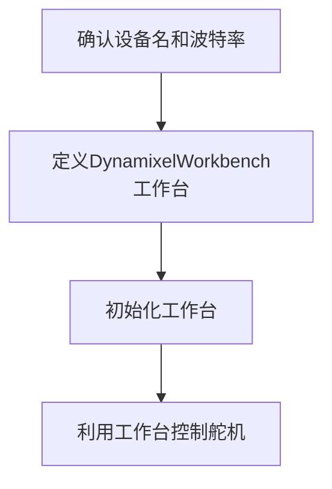
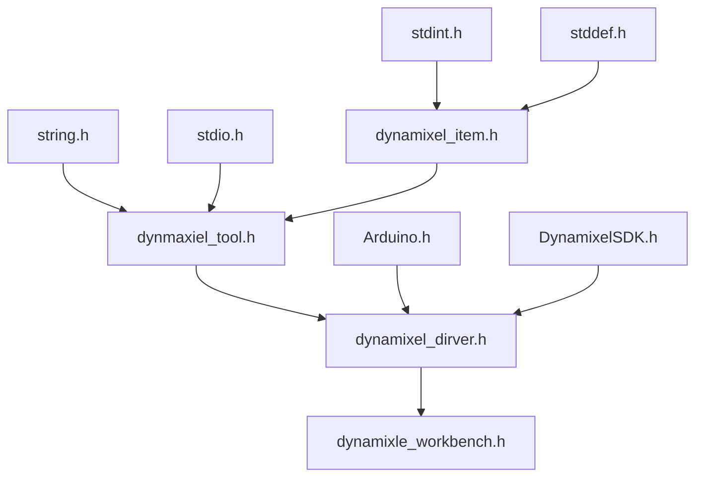

# DynamixelWorkbench Arduino 代码分析

## 1. 背景

​    [DynamixelWorkbench](https://emanual.robotis.com/docs/en/software/dynamixel/dynamixel_workbench/)是Robotis公司为了用户更加简单轻松使用Dynamixel舵机而开发的基于Dynamxiel SDK的库。

​    目前支持ROS、Linux、macOS、Arduino。

​    本文简单分析Arduino的代码结构和使用方法。

​    舵机类型为串口总线舵机。

[总线舵机是用数据的方式与舵机通信，通过指令包的发送和接收获取舵机当前位置和需要抵达的位置。是一种闭环的控制形式。]: https://www.zhihu.com/question/54184654	"知乎/哥本哈"

## 2. 例程分析

```c++
#include <DynamixelWorkbench.h>  // 引入头文件
#define DEVICE_NAME ""          // 与舵机通信的串口名
#define BAUDRATE  1000000       // 与舵机通信的波特率
#define DXL_ID    1             // 舵机ID号

DynamixelWorkbench dxl_wb;     // 定义一个工作台

void setup() 
{
  Serial.begin(57600);
  while(!Serial); // Wait for Opening Serial Monitor
  Serial.println("start");
  const char *log;bool result = false;

  uint8_t dxl_id = DXL_ID;
  uint16_t model_number = 0;
  // 初始化工作台，返回初始化结构，并且有反馈的日子信息log
  result = dxl_wb.init(DEVICE_NAME, BAUDRATE, &log);
  if (result == false)
  {
    Serial.println(log);
    Serial.println("Failed to init");
  }
  else
  {
    Serial.print("Succeeded to init : ");
    Serial.println(BAUDRATE);  
  }
  // 设备检查，返回检查结果，舵机模型编号，日志信息
  result = dxl_wb.ping(dxl_id, &model_number, &log);
  if (result == false)
  {
    Serial.println(log);
    Serial.println("Failed to ping");
  }
  else
  {
    Serial.println("Succeeded to ping");
    Serial.print("id : ");
    Serial.print(dxl_id);
    Serial.print(" model_number : ");
    Serial.println(model_number);
  }
}
void loop() {}
```

工作台使用流程：




## 3. 工程结构


头文件依赖关系



## 4. dynamixel_item.h

### 头文件

​    一切的开始在于dynamixel_item.h头文件。每一种舵机的相关信息（内存控制表）都会以item形式存储在代码文件中。相关逻辑如下：

​    第一步：首先是定义一个宏用来标识舵机的型号。例如

```c++
#define AX_12A     12          // DYNAMIXEL AX-12A是一款机器人专用智能舵机，它里面集成了直流电机+控制器+驱动器+传感器+减速器+网络。
#define AX_12W     300
#define AX_18A     18
#define RX_10      10 
```

​    第二步：定义了一个结构体（ControlItem），用来记录每一个舵机控制项的内容。控制表是由多个控制项组成的数组，作用是：控制表中可以标识出读写串口舵机ID、波特率、PID参数、启动力、保护电流、位置校正等控制项的相关信息。

```C++
typedef struct 
{
  const char *item_name;
  uint16_t    address;
  uint8_t	    item_name_length;
  uint16_t    data_length;
} ControlItem;

/* 
    比如：串口总线舵机与Arduino通信的波特率控制项。
    控制项名称为："Baud_Rate"
    控制项地址为：4
    控制项名大小：sizeof(s_Baud_Rate) - 1
    控制项数据长度： 1 字节
    如此设计是为了方便上层应用可以通过一个函数来发送多种控制项的命令
*/
static const char s_Baud_Rate[] = "Baud_Rate";
static const ControlItem items_AX[]{
    {s_Baud_Rate, 4, sizeof(s_Baud_Rate) - 1, 1},
}
```

​    第三步：定义了舵机信息。如最大位置弧度值等。rpm推测为每分钟转速.

```c++
typedef struct
{
  float rpm;

  int64_t value_of_min_radian_position;
  int64_t value_of_zero_radian_position;
  int64_t value_of_max_radian_position;

  float  min_radian;
  float  max_radian;
} ModelInfo;
```

​     第四步：最后头文件提供了获取控制表、舵机信息、控制项数量的方法。

```C++
namespace DynamixelItem
{
const ControlItem *getControlTable(uint16_t model_number);
const ModelInfo *getModelInfo(uint16_t model_number);

uint8_t getTheNumberOfControlItem();
}
```

### dynamixel_item.cpp

舵机控制信息

1. 首先是定义了大量的控制项名称。
2. 其次定义了控制表
3. 最后定义了舵机信息结构

```c++
// 省略大量控制项名称
static const char s_Baud_Rate[] = "Baud_Rate";
static const char s_Control_Mode[] = "Control_Mode";
static const char s_Firmware_Version[] = "Firmware_Version";
static const char s_ID[] = "ID";
static const char s_Lock[] = "Lock";
static const char s_Model_Number[] = "Model_Number";

// AX servos - (num == AX_12A || num == AX_12W || num == AX_18A)
static const ControlItem items_AX[]{
    {s_Model_Number, 0, sizeof(s_Model_Number) - 1, 2},
    {s_Firmware_Version, 2, sizeof(s_Firmware_Version) - 1, 1},
    {s_ID, 3, sizeof(s_ID) - 1, 1},
    {s_Baud_Rate, 4, sizeof(s_Baud_Rate) - 1, 1},
    // ......省略大量控制项
    {s_Return_Delay_Time, 5, sizeof(s_Return_Delay_Time) - 1, 1},
    {s_Lock, 47, sizeof(s_Lock) - 1, 1}};
#define COUNT_AX_ITEMS (sizeof(items_AX) / sizeof(items_AX[0])) // 舵机控制项总数

// 舵机信息
static const ModelInfo info_AX = {0.11,
                                  0,
                                  512,
                                  1024,
                                  -2.61799, 
                                  2.6179
```


获取控制表函数、获取舵机信息结构函数和获取控制项总数也非常容易实现。

只需要根据**舵机模型的编号**去返回相应的控制表地址、舵机信息结构地址即可。

必须先利用舵机模型编号获取了控制表地址后，才能去获取控制项总数。

## 5. dynamixel_tool.h

在dynamixel_item.h中，定义了舵机的控制表和舵机信息。在dynamixel_item.cpp中定义了几个系列的不同的舵机。

串口总线舵机采用菊花链连接，一个舵机串着一个舵机，一条链上相同系列的舵机通过设置ID号的不同来区分。对应同一类型的舵机，他的控制表是相同的，舵机模型信息是相同的，控制指令包通过指定不同的ID来控制单个或全部舵机。

现在需要一个工具类来管理一条链上相同系列的多个舵机。这个工具需要有以下几个基本功能：

1. 记录舵机模型编号，以及使用字符串记录舵机模型名称
2. 存储有一个控制表和一个模型信息
3. 记录控制表中控制项总数、舵机数、每个舵机的ID号
4. 向外部提供函数来获取控制表、模型信息等

### 头文件

```c++
class DynamixelTool
{
 private:
  enum {DYNAMIXEL_BUFFER = 30};
  uint8_t dxl_id_[DYNAMIXEL_BUFFER];       // 记录每个舵机的ID号 ID数组
  uint8_t dxl_cnt_;                        // 记录舵机总数
  const char *model_name_;                 // 舵机系列名称 详情见dynamixel_tool.cpp
  uint16_t model_number_;                  // 舵机系列编号 详情见dynamixel_itme.cpp
  const ControlItem *control_table_;       // 舵机控制表。一个工具只管理相同系列的舵机
  const ModelInfo *model_info_;            // 舵机信息结构，一个工具只管理相同系列的舵机
  uint16_t the_number_of_control_item_;    // 控制项总数
 public:
  DynamixelTool();
  ~DynamixelTool();
  void initTool(void);                     // 清空ID数组
  bool addTool(const char *model_name, uint8_t id, const char **log = NULL); // 利用舵机系列名称来初始化添加工具
  bool addTool(uint16_t model_number, uint8_t id, const char **log = NULL);  // 利用舵机编号来初始化添加工具
  void addDXL(uint8_t id);                 // 利用ID号，添加一个新的舵机

  const char *getModelName(void);
  uint16_t getModelNumber(void);

  // 省略部分函数，如获取最小弧度值等。
  uint8_t getTheNumberOfControlItem(void);
  const ControlItem *getControlItem(const char *item_name, const char **log = NULL);
  const ControlItem *getControlTable(void);
  const ModelInfo *getModelInfo(void);
 private:
  bool setControlTable(const char *model_name, const char **log = NULL);
  bool setControlTable(uint16_t model_number, const char **log = NULL);
  bool setModelName(uint16_t model_number, const char **log = NULL);
  bool setModelNumber(const char *model_name, const char **log = NULL);
};
```

### dynamixel_tool.cpp

```c++
typedef struct 
{
  uint16_t      number;
  const char*   name; 
} DynamixelModel;

static const DynamixelModel dynamixel_model_table[] = {
    {AX_12A, "AX-12A"},
    {AX_12W, "AX-12W"},
    {AX_18A, "AX-18A"},

    {RX_10, "RX-10"}
};   // 每一个舵机型号，都有一个相对应的舵机名称
#define COUNT_DYNAMIXEL_MODEL  (sizeof(dynamixel_model_table)/sizeof(dynamixel_model_table[0]))
```

实现逻辑：

​    DynamixelTool类

​    类构造函数作用是将舵机数、控制项数清零，这些数将会影响程序的运行。首次构造了对象后，需要使用addTool()方法来添加工具（设置对象的私有变量：控制表、舵机信息等），并且设置第一个舵机的ID号。添加有两种重构的方法：一、使用舵机系列名称。二、使用舵机系列编号。添加工具只需要进行一次即可。之后同个系列的舵机都会利用工具对象来添加自己的ID号，使用方法是addDXL()。剩余的方法是：获取私有变量的方法。

## 6. dynamixel_driver.h 

​    到目前为止，已经有了舵机信息、控制表、舵机信息控制表工具类。而对于实际舵机该如何控制，还没有相关的代码实现。具体控制的实现就在dynamixel_driver.h和dynamixel_driver.cpp两个文件中。

​    首先需要明确的是，舵机类型是串口总线舵机。那么肯定需要串口通信能力、以及通信协议。

### 串口通信

​    串口通信由[DynamixelSDK](https://emanual.robotis.com/docs/en/software/dynamixel/dynamixel_sdk/overview/)下port_handler.h里的dynamixel::PortHandler提供。查看源码可知，这是一个父类，他有着PortHandlerLinux, PortHandlerWindows, PortHandlerMac, or PortHandlerArduino等子类。这些子类提供了不同平台上对于串口通信的支持。主要的功能有：

1. 获取串口控制器
2. 打开串口、关闭串口
3. 设置串口名称、设置波特率
4. 获取可读字节数目、读取数据、写入数据
5. 超时处理

这里重点关注Arduino。下面简单的分析实现逻辑。

PortHandlerArduino继承了PortHandler，就需要实现父类中的虚方法，如打开串口等。在实现中，Robotis公司有一块兼容Arduino的板子称为OpenCR。这块板子与舵机的通信使用的Serial3(UART模块串口3)，舵机供电引脚编号为32。利用UART Serial3实现了串口通信的功能。具体就不再展开。

```c++
#if defined (__OPENCR__)
#define DYNAMIXEL_SERIAL  Serial3
#endif
#define BDPIN_DXL_PWR_EN        32
```

注：dynamixelsdk是一个软件开发工具包，它使用数据包通信提供DYNAMIXEL控制功能。DYNAMIXEL SDK的API是为DYNAMIXEL执行器和基于DYNAMIXEL的平台设计的。

### 通信协议

​    利用PortHandler拥有与串口通信的能力。但是通信的数据是什么样子，这个问题是需要人为定义的。哪些数据是有效的，什么数据先，什么数据后，每个数据的含义。在这里DynamixelSDK下的packet_handler.h文件里PacketHandler类提供相应的服务。它有两个之类Protocol1PacketHandler和Protocol2PacketHandler。这是有ROBOTIS公司定义的，有两种通信协议。PackeHandler类的方法需要传入参数——PortHandelr的对象来支持串口通信。

[Protocol1协议](https://emanual.robotis.com/docs/en/dxl/protocol1/)


[Protocol2](https://emanual.robotis.com/docs/en/dxl/protocol2/)


#### 多种通信模式

​    在DynamixelSDK有多种读写串口的方式：

1. 普通型——dynamixel::PacketHandler
2. 加强型——dynamixel::GroupSyncRead dynamixel::GroupSyncWrite(同步读写)
3. 至尊型——dynamixel::GroupBulkRead dynamixel::GroupBulkWrite(批量读写)

对于同步读写，代码注释写着**The class for writing/reading multiple Dynamixel data from same address with same length at once**，表明可以一次性从多个舵机中读取相同地址（相同控制项）。

对于批量读写，代码注释写着**The class for writing/reading multiple Dynamixel data from different addresses with different lengths at once**，表明可以一次性从多个舵机中读取不同地址的不同数据（不同控制项）。

### dynamixel_driver.h

​    在具有了以上的一些内容之后，终于可以进入到dynamixel_driver.h这个头文件里来看看舵机驱动是怎么样的了。  首先还是暂时忽略掉同步读写以及批量读写的内容，只关注基础读写。那么在DynamixelDriver这个类中实现基础读写，就需要串口控制器PortHandler、协议控制器PacketHandler、舵机控制工具类DynamixelTool。在这个驱动中，需要有的功能如下：

1. 初始化
2. 设置串口控制器，串口波特率
3. 设置协议控制器，协议版
4. 获取函数，如获取使用的波特率，串口控制器，舵机系列编号，舵机系列名称等
5. 扫描所有可以使用的舵机
6. 根据舵机 ID 号ping（诊断）
7. 写入控制项的数据
8. 读取控制项的数

```c++
#define MAX_DXL_SERIES_NUM  5
class DynamixelDriver
{
 private:
  dynamixel::PortHandler   *portHandler_;     // 串口控制器
  dynamixel::PacketHandler *packetHandler_;   // 协议控制器
  
  DynamixelTool tools_[MAX_DXL_SERIES_NUM];   // 这里的工具类数组是为了能在一个链控制多个舵机系列
  uint8_t tools_cnt_;
 public:
  DynamixelDriver();
  ~DynamixelDriver();

  bool init(const char* device_name = "/dev/ttyUSB0", 
            uint32_t baud_rate = 57600, 
            const char **log = NULL);      // 初始化，对于Arduino来说默认Serial3已经指定了设备

  bool begin(const char* device_name = "/dev/ttyUSB0", 
            uint32_t baud_rate = 57600, 
            const char **log = NULL);

  bool setPortHandler(const char *device_name, const char **log = NULL);
  bool setBaudrate(uint32_t baud_rate, const char **log = NULL);
  bool setPacketHandler(float protocol_version, const char **log = NULL);

  float getProtocolVersion(void);
  uint32_t getBaudrate(void);

  // 忽略get方法，如getModelInfo等
    
    
  bool scan(uint8_t *get_id,
            uint8_t *get_the_number_of_id, 
            uint8_t range = 253,
            const char **log = NULL);    // 扫描方法一，可以扫描出两种协议下的不同ID号的舵机

  bool scan(uint8_t *get_id,
            uint8_t *get_the_number_of_id, 
            uint8_t start_number,
            uint8_t end_number,
            const char **log = NULL);

  bool ping(uint8_t id, 
            uint16_t *get_model_number,
            const char **log = NULL);

  bool ping(uint8_t id,
            const char **log = NULL);

  bool clearMultiTurn(uint8_t id, const char **log = NULL);   //？ 这里不清楚是什么作用

  bool reboot(uint8_t id, const char **log = NULL);           //？ 这里不清楚是什么作用
  bool reset(uint8_t id, const char **log = NULL);            //？ 这里不清楚是什么作用

  bool writeRegister(uint8_t id, uint16_t address, uint16_t length, uint8_t* data, const char **log = NULL);            // 利用地址，写入控制项的数据
  bool writeRegister(uint8_t id, const char *item_name, int32_t data, const char **log = NULL);                        // 利用定义好的控制项名称，写入控制项数据

  bool writeOnlyRegister(uint8_t id, uint16_t address, uint16_t length, uint8_t *data, const char **log = NULL);
  bool writeOnlyRegister(uint8_t id, const char *item_name, int32_t data, const char **log = NULL);

  bool readRegister(uint8_t id, uint16_t address, uint16_t length, uint32_t *data, const char **log = NULL);            // 读取控制项的数据
  bool readRegister(uint8_t id, const char *item_name, int32_t *data, const char **log = NULL);

 private:
  void initTools(void);
  bool setTool(uint16_t model_number, uint8_t id, const char **log = NULL);
  uint8_t getTool(uint8_t id, const char **log = NULL);
};
```

#### API

驱动的一般使用流程。

1. 实例化类：DynamixelDriver
2. 利用对象初始化，begin()或init()。需要指定设备名称、波特率等。OpenCR-Arduino上无需指定设备名称
3. 如果是写入控制项数据，则需要使用writeRegister()方法。需要指定控制项名称或者控制项地址，以及数据
4. 如果是读取数据，readRegister
5. scan 扫描可用设备 ping 诊断特定舵机是否连通

### dynamixel_driver.cpp

实现

```c++
bool DynamixelDriver::init(const char *device_name, uint32_t baud_rate, const char **log)
{
  bool result = false;
  // 初始化重点是设置串口控制器、串口波特率、协议控制器
  result = setPortHandler(device_name, log);
  if (result == false) return false;

  result = setBaudrate(baud_rate, log);
  if (result == false) return false;

  result = setPacketHandler(2.0f, log);
  if (result == false) return false;
  return result;
}
bool DynamixelDriver::setPortHandler(const char *device_name, const char **log)
{
  portHandler_ = dynamixel::PortHandler::getPortHandler(device_name);
  if (portHandler_->openPort())
  {
    if (log != NULL) *log = "[DynamixelDriver] Succeeded to open the port!";
    return true;
  }

  if (log != NULL) *log = "[DynamixelDriver] Failed to open the port!";
  return false;
}
bool DynamixelDriver::setBaudrate(uint32_t baud_rate, const char **log)
{
  if (portHandler_->setBaudRate((int)baud_rate))
  {
    if (log != NULL) *log = "[DynamixelDriver] Succeeded to change the baudrate!";
    return true;
  }
  if (log != NULL) *log = "[DynamixelDriver] Failed to change the baudrate!";
  return false;
}
bool DynamixelDriver::setPacketHandler(float protocol_version, const char **log)
{
  packetHandler_ = dynamixel::PacketHandler::getPacketHandler(protocol_version);
  if (packetHandler_->getProtocolVersion() == protocol_version)
  {
    if (log != NULL) *log = "[DynamixelDriver] Succeeded to set the protocol!";
    return true;
  }
  if (log != NULL) *log = "[DynamixelDriver] Failed to set the protocol!";
  return false;
}
```

在拥有以上的控制器之后，需要实现基本的读写通信功能。

写：

```c++
bool DynamixelDriver::writeRegister(uint8_t id, uint16_t address, uint16_t length, uint8_t* data, const char **log)
{
  // 本函数使用控制项地址的方式控制，每次只传输一个字节。还有一种使用控制项名称的方式。使用方法类似，这里不再赘述。
  ErrorFromSDK sdk_error = {0, false, false, 0};    
  // 标记舵机通信的错误信息，定义如下：
  // typedef struct{int dxl_comm_result;bool dxl_addparam_result;bool dxl_getdata_result;uint8_t dxl_error;} ErrorFromSDK;
 // dxl_comm_result 用来记录通信情况，常见有串口忙、TX失败、RX失败、指令包无效。。。具体见packet_handler.h Communication Result
  delay(10);
  // 实际使用协议控制器来调用串口控制器输出具体的字符流
  sdk_error.dxl_comm_result = packetHandler_->writeTxRx(portHandler_, 
                                                        id, 
                                                        address, 
                                                        length, 
                                                        data,
                                                        &sdk_error.dxl_error);
  if (sdk_error.dxl_comm_result != COMM_SUCCESS){
    if (log != NULL) *log = packetHandler_->getTxRxResult(sdk_error.dxl_comm_result);
    return false;}
  else if (sdk_error.dxl_error != 0){
    if (log != NULL) *log = packetHandler_->getRxPacketError(sdk_error.dxl_error);
    return false;}
  else{
    if (log != NULL) *log = "[DynamixelDriver] Succeeded to write!";
    return true;}
  return false;}
```

读：

```c++
bool DynamixelDriver::readRegister(uint8_t id, const char *item_name, int32_t *data, const char **log)
{
  ErrorFromSDK sdk_error = {0, false, false, 0};
  const ControlItem *control_item;
  uint8_t factor = getTool(id, log);           // 获取工具管理类对象
  if (factor == 0xff) return false;
  control_item = tools_[factor].getControlItem(item_name, log); //  获取控制项
  if (control_item == NULL) return false;
  uint8_t data_1_byte  = 0;
  uint16_t data_2_byte = 0;
  uint32_t data_4_byte = 0;
  switch (control_item->data_length)
  {
    case BYTE:
      // 单字节控制信息传递
      sdk_error.dxl_comm_result = packetHandler_->read1ByteTxRx(portHandler_,
                                                            id,
                                                            control_item->address,
                                                            &data_1_byte,
                                                            &sdk_error.dxl_error);
     break;
    case WORD:
      sdk_error.dxl_comm_result = packetHandler_->read2ByteTxRx(portHandler_,
                                                            id,
                                                            control_item->address,
                                                            &data_2_byte,
                                                            &sdk_error.dxl_error);
     break;
    case DWORD:
      sdk_error.dxl_comm_result = packetHandler_->read4ByteTxRx(portHandler_,
                                                            id,
                                                            control_item->address,
                                                            &data_4_byte,
                                                            &sdk_error.dxl_error);
     break;
    default:
      sdk_error.dxl_comm_result = packetHandler_->read1ByteTxRx(portHandler_,
                                                            id,
                                                            control_item->address,
                                                            &data_1_byte,
                                                            &sdk_error.dxl_error);
     break;
  }
  if (sdk_error.dxl_comm_result != COMM_SUCCESS){
    if (log != NULL) *log = packetHandler_->getTxRxResult(sdk_error.dxl_comm_result);
    return false;
  }
  else if (sdk_error.dxl_error != 0){
    if (log != NULL) *log = packetHandler_->getRxPacketError(sdk_error.dxl_error);
    return false;
  }
  else{
    switch (control_item->data_length)
    {
      case BYTE:
        *data = data_1_byte;break;
      case WORD:
        *data = data_2_byte;break;
      case DWORD:
        *data = data_4_byte;break;
      default:
        *data = data_1_byte;break;
    }
    if (log != NULL) *log = "[DynamixelDriver] Succeeded to read!";
    return true;
  }
  return false;}
```

同步读写、批量读写暂时不处理。

## 7. dynamixel_workbench.h

​    经过上面的内容，已经可以向特定的舵机写入具体的控制项内容了。但是这种抽象还是不够简单。针对每一个控制项，设置好驱动对象后，要么找到相应的控制项地址，要么找到控制项名称，根据地址、名称设置所需要的参数。使用比较复杂，针对比较常见的舵机功能可以封装出来，只需要传递具体数据，无需关注特定的控制项地址名称。例如设置扭矩开关，ID号的获取与处理，目标位置，目标速度，当前位置，当前速度等。那么就建立一个工作台类来进一步简化工作设置，由于与驱动类功能重合，所以可以直接设置工作台继承驱动类。一个基础的工作台需要有以下的功能。

```c++
#include "dynamixel_driver.h"
class DynamixelWorkbench : public DynamixelDriver
{
 public:
  DynamixelWorkbench();
  ~DynamixelWorkbench();

  bool torque(uint8_t id, int32_t onoff, const char **log = NULL);  // 设置扭矩开关，通过设置Torque_Enable控制项，id: 舵机ID  onoff: 开关变量
  bool torqueOn(uint8_t id, const char **log = NULL);               // 打开力矩输出
  bool torqueOff(uint8_t id, const char **log = NULL);              // 关闭力矩输出

  bool changeID(uint8_t id, uint8_t new_id, const char **log = NULL);// 名称：ID 改变ID号，改变ID会导致力矩输出关闭
  bool changeBaudrate(uint8_t id, uint32_t new_baudrate, const char **log = NULL); // 名称： Baud_Rate 更改波特率
  bool changeProtocolVersion(uint8_t id, uint8_t version, const char **log = NULL);

  bool itemWrite(uint8_t id, const char *item_name, int32_t data, const char **log = NULL); // 写控制项数据，使用的方法是DynamixelDriver::writeRegister()
  bool itemRead(uint8_t id, const char *item_name, int32_t *data, const char **log = NULL); // 读取控制项数据，使用的方法是DynamixelDriver::readRegister()

  bool led(uint8_t id, int32_t onoff, const char **log = NULL); // 名称：LED
  bool ledOn(uint8_t id, const char **log = NULL);
  bool ledOff(uint8_t id, const char **log = NULL);
  
  // 省略部分型号的特殊设置 Drvie_Mode Secondary_ID PWM控制模式 位置控制模式
    
  bool jointMode(uint8_t id, int32_t velocity = 0, int32_t acceleration = 0, const char **log = NULL); // 设置位置模式
  bool wheelMode(uint8_t id, int32_t acceleration = 0, const char **log = NULL); // 速度模式
  bool goalPosition(uint8_t id, int32_t value, const char **log = NULL); // 名称：Goal_Position 设置目标位置
  bool goalVelocity(uint8_t id, int32_t value, const char **log = NULL); // Goal_Velocity和Moving_Speed 目标速度
  bool getPresentPositionData(uint8_t id, int32_t* data, const char **log = NULL); // Present_Position
  bool getPresentVelocityData(uint8_t id, int32_t* data, const char **log = NULL); // Present_Veloctiy
};

```


